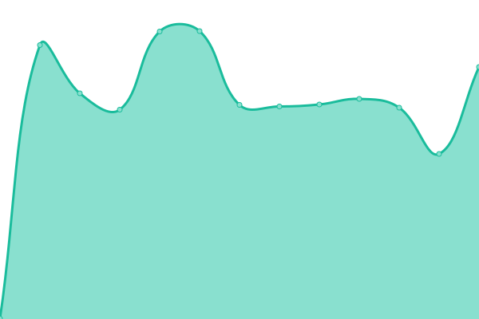

# [📈 Live Status](https://status.testrtc.com): <!--live status--> **🟩 All systems operational**

This repository contains the open-source uptime monitor and status page for [testRTC](https://testrtc.com/), powered by [Upptime](https://github.com/upptime/upptime).

With [Upptime](https://upptime.js.org), you can get your own unlimited and free uptime monitor and status page, powered entirely by a GitHub repository. We use [Issues](https://github.com/testRTC/status-page/issues) as incident reports, [Actions](https://github.com/testRTC/status-page/actions) as uptime monitors, and [Pages](https://status.testrtc.com) for the status page.

<!--start: status pages-->
<!-- This summary is generated by Upptime (https://github.com/upptime/upptime) -->
<!-- Do not edit this manually, your changes will be overwritten -->
<!-- prettier-ignore -->
| URL | Status | History | Response Time | Uptime |
| --- | ------ | ------- | ------------- | ------ |
|  [Frontend](https://app.testrtc.com/) | 🟩 Up | [frontend.yml](https://github.com/testRTC/status-page/commits/master/history/frontend.yml) | 

 230ms
     
 | 

<a href="https://status-staging.testrtc.com/history/frontend">100.00%</a>
    

|  [Backend](https://app1.testrtc.com/api/status-page/system_name) | 🟩 Up | [backend.yml](https://github.com/testRTC/status-page/commits/master/history/backend.yml) | 

 185ms
     
 | 

<a href="https://status-staging.testrtc.com/history/backend">100.00%</a>
    

|  [API (Staging)](https://api.testrtc.com/v1st/statuspage) | 🟩 Up | [api-staging.yml](https://github.com/testRTC/status-page/commits/master/history/api-staging.yml) | 

 231ms
     
 | 

<a href="https://status-staging.testrtc.com/history/api-staging">100.00%</a>
    

|  [watchRTC (Staging)](https://watchrtc-staging2.testrtc.com/healthcheck) | 🟩 Up | [watch-rtc-staging.yml](https://github.com/testRTC/status-page/commits/master/history/watch-rtc-staging.yml) | 

 154ms
     
 | 

<a href="https://status-staging.testrtc.com/history/watch-rtc-staging">100.00%</a>
    

|  [qualityRTC](https://ping-test.testrtc.com/) | 🟩 Up | [quality-rtc.yml](https://github.com/testRTC/status-page/commits/master/history/quality-rtc.yml) | 

 193ms
     
 | 

<a href="https://status-staging.testrtc.com/history/quality-rtc">100.00%</a>
    

|  [probeRTC](https://probertc.testrtc.com/) | 🟩 Up | [probe-rtc.yml](https://github.com/testRTC/status-page/commits/master/history/probe-rtc.yml) | 

 297ms
     
 | 

<a href="https://status-staging.testrtc.com/history/probe-rtc">100.00%</a>
    

|  [Home Page](https://testrtc.com/) | 🟩 Up | [home-page.yml](https://github.com/testRTC/status-page/commits/master/history/home-page.yml) | 

 166ms
     
 | 

<a href="https://status-staging.testrtc.com/history/home-page">100.00%</a>
    

|  [qualityRTC Speed Test sa-east-1](https://sa-east-1.nettest.testrtc.com/country) | 🟩 Up | [quality-rtc-speed-test-sa-east-1.yml](https://github.com/testRTC/status-page/commits/master/history/quality-rtc-speed-test-sa-east-1.yml) | 

 446ms
     
 | 

<a href="https://status-staging.testrtc.com/history/quality-rtc-speed-test-sa-east-1">100.00%</a>
    

|  [qualityRTC Speed Test eu-central-1](https://eu-central-1.nettest.testrtc.com/country) | 🟩 Up | [quality-rtc-speed-test-eu-central-1.yml](https://github.com/testRTC/status-page/commits/master/history/quality-rtc-speed-test-eu-central-1.yml) | 

 453ms
     
 | 

<a href="https://status-staging.testrtc.com/history/quality-rtc-speed-test-eu-central-1">100.00%</a>
    

|  [qualityRTC Speed Test eu-west-1](https://eu-west-1.nettest.testrtc.com/country) | 🟩 Up | [quality-rtc-speed-test-eu-west-1.yml](https://github.com/testRTC/status-page/commits/master/history/quality-rtc-speed-test-eu-west-1.yml) | 

 347ms
     
 | 

<a href="https://status-staging.testrtc.com/history/quality-rtc-speed-test-eu-west-1">100.00%</a>
    

|  [qualityRTC Speed Test eu-west-3](https://eu-west-3.nettest.testrtc.com/country) | 🟩 Up | [quality-rtc-speed-test-eu-west-3.yml](https://github.com/testRTC/status-page/commits/master/history/quality-rtc-speed-test-eu-west-3.yml) | 

 382ms
     
 | 

<a href="https://status-staging.testrtc.com/history/quality-rtc-speed-test-eu-west-3">100.00%</a>
    

|  [qualityRTC Speed Test us-east-1](https://us-east-1.nettest.testrtc.com/country) | 🟩 Up | [quality-rtc-speed-test-us-east-1.yml](https://github.com/testRTC/status-page/commits/master/history/quality-rtc-speed-test-us-east-1.yml) | 

 151ms
     
 | 

<a href="https://status-staging.testrtc.com/history/quality-rtc-speed-test-us-east-1">100.00%</a>
    

|  [qualityRTC Speed Test us-west-2](https://us-west-2.nettest.testrtc.com/country) | 🟩 Up | [quality-rtc-speed-test-us-west-2.yml](https://github.com/testRTC/status-page/commits/master/history/quality-rtc-speed-test-us-west-2.yml) | 

 290ms
     
 | 

<a href="https://status-staging.testrtc.com/history/quality-rtc-speed-test-us-west-2">100.00%</a>
    

|  [qualityRTC Speed Test sa-east-1](https://sa-east-1.nettest.testrtc.com/country) | 🟩 Up | [quality-rtc-speed-test-sa-east-1.yml](https://github.com/testRTC/status-page/commits/master/history/quality-rtc-speed-test-sa-east-1.yml) | 

 446ms
     
 | 

<a href="https://status-staging.testrtc.com/history/quality-rtc-speed-test-sa-east-1">100.00%</a>
    

|  [qualityRTC Speed Test ap-southeast-1](https://ap-southeast-1.nettest.testrtc.com/country) | 🟩 Up | [quality-rtc-speed-test-ap-southeast-1.yml](https://github.com/testRTC/status-page/commits/master/history/quality-rtc-speed-test-ap-southeast-1.yml) | 

 808ms
     
 | 

<a href="https://status-staging.testrtc.com/history/quality-rtc-speed-test-ap-southeast-1">100.00%</a>
    

|  [qualityRTC Speed Test ap-northeast-1](https://ap-northeast-1.nettest.testrtc.com/country) | 🟩 Up | [quality-rtc-speed-test-ap-northeast-1.yml](https://github.com/testRTC/status-page/commits/master/history/quality-rtc-speed-test-ap-northeast-1.yml) | 

 607ms
     
 | 

<a href="https://status-staging.testrtc.com/history/quality-rtc-speed-test-ap-northeast-1">100.00%</a>
    

|  [qualityRTC Speed Test ap-southeast-2](https://ap-southeast-2.nettest.testrtc.com/country) | 🟩 Up | [quality-rtc-speed-test-ap-southeast-2.yml](https://github.com/testRTC/status-page/commits/master/history/quality-rtc-speed-test-ap-southeast-2.yml) | 

 689ms
     
 | 

<a href="https://status-staging.testrtc.com/history/quality-rtc-speed-test-ap-southeast-2">100.00%</a>
    

|  [qualityRTC Speed Test af-south-1](https://af-south-1.nettest.testrtc.com/country) | 🟩 Up | [quality-rtc-speed-test-af-south-1.yml](https://github.com/testRTC/status-page/commits/master/history/quality-rtc-speed-test-af-south-1.yml) | 

 795ms
     
 | 

<a href="https://status-staging.testrtc.com/history/quality-rtc-speed-test-af-south-1">100.00%</a>
    

<!--end: status pages-->

[**Visit our status website →**](https://status.testrtc.com)

## 📄 License

- Powered by: [Upptime](https://github.com/upptime/upptime)
- Code: [MIT](./LICENSE) © [testRTC](https://testrtc.com/)
- Data in the `./history` directory: [Open Database License](https://opendatacommons.org/licenses/odbl/1-0/)
